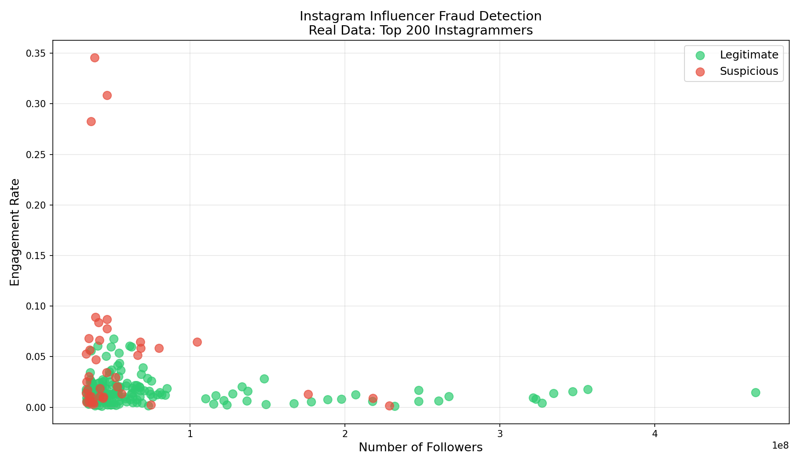

# Instagram Influencer Fraud Detector

Detecting suspicious Instagram influencers using Python and Machine Learning.

## 📊 Project Overview
Analyzed real data of Top 200 Instagram influencers and flagged suspicious accounts based on abnormal engagement patterns using Isolation Forest algorithm.

## 🔍 Key Findings
- Analyzed 200 real Instagram influencer accounts
- Flagged suspicious accounts with abnormally low engagement despite high followers
- Found that many high-follower accounts had engagement rates below 1%

## 🛠️ Tools & Technologies
- Python
- Pandas
- Scikit-learn (Isolation Forest)
- Matplotlib

## 📁 Dataset
Real data from Kaggle: Top 200 Instagram Influencers (by Syed Jafer)

## 📈 Result

## 🚀 How to Run
1. Clone this repository
2. Install requirements: `pip install pandas scikit-learn matplotlib`
3. Open `instafraud.ipynb` in Jupyter Notebook
4. Run all cells
